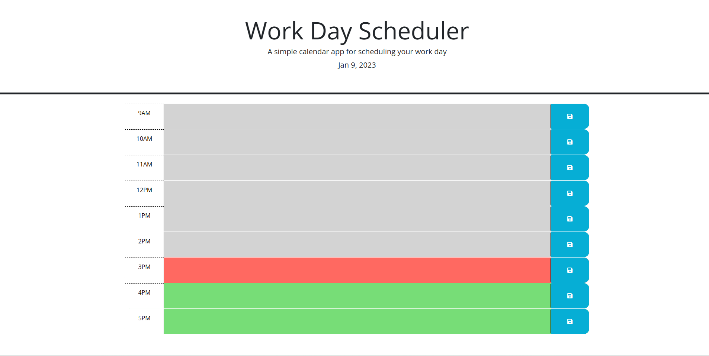
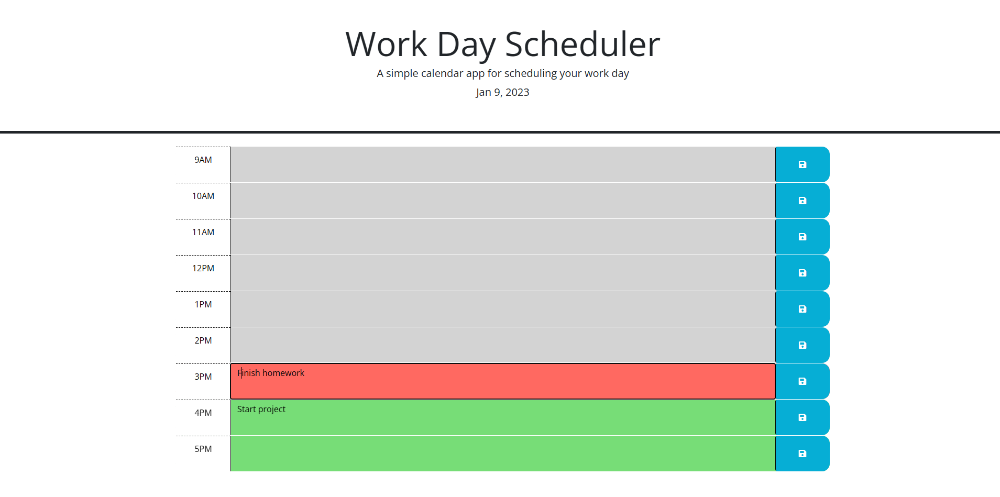

# Day-Scheduler

## Description

This day scheduler was designed to keep the users daily tasks organized. Making this app helped me learn how to use the local storage to save the users input even after the user refresh the screen or return to the webpage at a later time. The time slots are color coded with gray meaning the event has passed, red highlighting the current hour`s task and green representing upcoming tasks.

## Usage

- Navigate to https://tanglero4.github.io/Day-Scheduler/
- Click on a time slot, jot down the tasks you would like to save on the slots and click the blue button on the right of the slot to save your information.
  

## Credits

UCF Coding Bootcamp

## License

N/A
